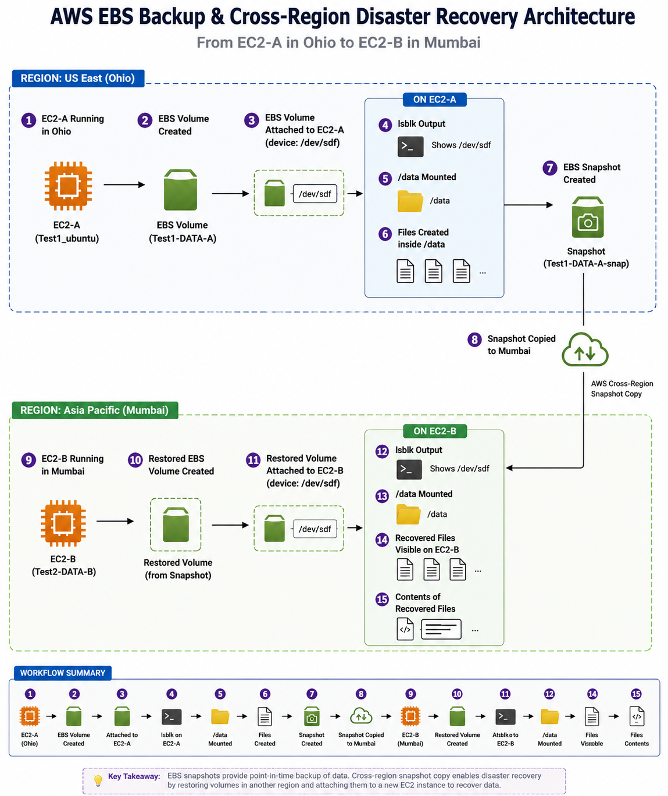

## Architecture

  

---------------------
## EC2 EBS Snapshot to Root Volume Recovery
1. Objective
The objective of this self-paced exercise is to understand how an Amazon EBS snapshot can be used to recreate the storage state of an EC2 instance and investigate whether the snapshot can be used as the root/boot volume of another EC2 instance.
This exercise is also designed to compare AWS EBS storage behavior with a traditional physical-server scenario where an existing NVMe/SSD containing the operating system, applications, configuration, and data is moved from one physical machine to another.
________________________________________

---------------------------------------------------------
## 2. Physical Machine Analogy
Consider the following physical-server scenario:
Physical Machine 1
└── NVMe SSD
    ├── Windows/Linux OS
    ├── Applications
    ├── Configuration
    └── Files / Data
If Machine 1 fails and the hardware is compatible, one possible physical recovery approach could be:
Machine 1
    │
    │ Shut down
    ▼
Remove the same NVMe SSD
    │
    ▼
Install NVMe SSD into Machine 2
    │
    ▼
Boot Machine 2
    │
    ▼
OS + Applications + Configuration + Files
The important point is that the same physical storage device is being moved from Machine 1 to Machine 2.
________________________________________
3. AWS Equivalent
In AWS, an EBS volume is conceptually similar to a storage device attached to an EC2 instance.
EC2 Instance 1
└── Root EBS Volume
    ├── OS
    ├── Applications
    ├── Configuration
    └── Files / Data
An EBS snapshot is a point-in-time representation of the EBS volume.
EC2 Instance 1
      │
      ▼
Root EBS Volume
      │
      ▼
EBS Snapshot
A snapshot is not the same thing as physically moving the original EBS volume.
When a new volume is created from the snapshot, AWS recreates the volume based on the snapshot’s point-in-time state.
Original EBS Volume
       │
       ▼
    Snapshot
       │
       ▼
New EBS Volume
Therefore, the AWS snapshot workflow is conceptually closer to:
Machine 1
   │
   └── Storage
        │
        ▼
      Backup
        │
        ▼
   Recreated Storage
        │
        ▼
    Machine 2
rather than physically moving the same storage device.
________________________________________
4. Initial EC2 Scenario
EC2 Instance 1
Create an EC2 instance with its normal/root EBS volume.
For this exercise, no additional EBS data volume is required.
EC2 Instance 1
└── Root EBS Volume
    ├── OS
    ├── Applications
    ├── Configuration
    ├── file1.txt
    ├── file2.txt
    ├── file3.txt
    ├── directory1/
    │   ├── test1.txt
    │   └── test2.txt
    └── directory2/
        └── test3.txt
Create files and directories on the root filesystem and verify that they are accessible.
Example:
mkdir -p ~/snapshot-lab/directory1
mkdir -p ~/snapshot-lab/directory2

touch ~/snapshot-lab/file1.txt
touch ~/snapshot-lab/file2.txt
touch ~/snapshot-lab/file3.txt

touch ~/snapshot-lab/directory1/test1.txt
touch ~/snapshot-lab/directory1/test2.txt
touch ~/snapshot-lab/directory2/test3.txt
Verify:
find ~/snapshot-lab -type f
________________________________________
5. Create EBS Snapshot
Take a snapshot of the root EBS volume of EC2 Instance 1.
EC2 Instance 1
      │
      ▼
Root EBS Volume
      │
      ▼
EBS Snapshot
The snapshot represents the storage state at the time the snapshot was created.
________________________________________
6. Proposed EC2 Instance 2 Scenario
The next question is whether the snapshot can be used as the root/boot storage of EC2 Instance 2, rather than simply being attached as an additional data volume.
The desired architecture is:
              EBS Snapshot
                   │
                   ▼
          Snapshot-derived
             Root Volume
                   │
                   ▼
            EC2 Instance 2
                   │
          ┌────────┴────────┐
          │                 │
         OS          Applications
          │                 │
     Configuration       Files/Data
The goal is for Instance 2 to boot from the storage recreated from Instance 1’s snapshot.
________________________________________
7. Comparison With Secondary-Volume Recovery
A simpler recovery scenario is:
EC2 Instance 1
└── Root EBS
      │
      ▼
   Snapshot
      │
      ▼
New EBS Volume
      │
      ▼
EC2 Instance 2
├── Root EBS
└── Snapshot-derived EBS
          │
          ▼
       /data
In this scenario, the snapshot-derived volume is used as a secondary data volume.
The files from Instance 1 can then be accessed after mounting the volume.
________________________________________
8. Root-Volume Recovery Scenario
The more advanced scenario being investigated is:
EC2 Instance 1
└── Root EBS
      │
      ▼
   Snapshot
      │
      ▼
Root/Boot Volume
      │
      ▼
EC2 Instance 2
└── Root EBS
    ├── OS
    ├── Applications
    ├── Configuration
    └── Files/Data
The objective is to determine whether Instance 2 can boot directly from the storage represented by the snapshot.
This is conceptually much closer to the physical-machine scenario:
Physical World

Machine 1
└── NVMe
      │
      │ Move storage
      ▼
Machine 2
└── Same NVMe
      │
      ▼
Boot existing OS
The AWS equivalent being investigated is:
AWS

EC2 Instance 1
└── Root EBS
      │
      │ Snapshot
      ▼
    Snapshot
      │
      │ Recreate/use as root
      ▼
EC2 Instance 2
└── Root EBS
      │
      ▼
Boot existing OS state
________________________________________
9. Important Difference
The physical-machine scenario involves the same physical NVMe device.
AWS EBS snapshots work differently.
Physical Machine
──────────────────────────────

Machine 1
    │
    └── Physical NVMe
             │
             │ physically moved
             ▼
         Machine 2
Whereas:
AWS
──────────────────────────────

EC2 Instance 1
    │
    └── EBS Volume
             │
             ▼
          Snapshot
             │
             ▼
      New EBS Volume
             │
             ▼
         EC2 Instance 2
Therefore, the snapshot-based approach is a storage recreation/recovery mechanism, not physical movement of the same storage device.
________________________________________
10. Questions for Mentor
The following questions are the main learning objectives of this exercise.
Question 1 – Snapshot Recovery
Is taking a snapshot of the root EBS volume and restoring its contents onto another EC2 instance a valid approach for an EBS backup/recovery scenario?
Question 2 – Root Volume
Instead of attaching the snapshot-derived volume as a secondary volume, can the snapshot be used to create the root/boot volume of EC2 Instance 2?
Question 3 – Physical NVMe Equivalent
In the physical world:
Machine 1
└── NVMe
    ├── OS
    ├── Applications
    ├── Configuration
    └── Data
If the same NVMe is moved to Machine 2, Machine 2 can potentially boot from that existing storage.
Is there an equivalent AWS approach where the storage state of EC2 Instance 1 can become the primary/root storage of EC2 Instance 2?
Question 4 – EBS Snapshot vs AMI
For creating a replacement EC2 instance with the same OS, applications, configuration, and data, should the recommended AWS approach be:
EBS Snapshot
      │
      ▼
New EBS Volume
      │
      ▼
EC2 Instance 2
or:
EC2 Instance 1
      │
      ▼
AMI
      │
      ▼
EC2 Instance 2
Question 5 – Existing EBS Volume
If the requirement is to use the actual existing EBS volume, rather than creating a new volume from a snapshot, can the original EBS volume be detached from Instance 1 and attached to Instance 2?
Question 6 – Production Approach
In a real-world production environment, what would be the preferred approach for recovering a failed EC2 instance while preserving:
•	Operating system
•	Applications
•	Configuration
•	Files
•	Application data
Would the preferred solution be:
•	EBS snapshot recovery
•	AMI-based recovery
•	Root-volume replacement
•	Existing EBS volume migration
•	AWS Backup
•	Another production recovery mechanism
________________________________________
11. Learning Outcome
This exercise is intended to understand the difference between:
EBS Volume
     │
     ├── Actual storage attached to EC2
     │
     ▼
EBS Snapshot
     │
     ├── Point-in-time storage backup
     │
     ▼
New EBS Volume
     │
     ├── Recreated storage from snapshot
     │
     ▼
EC2 Instance
and:
AMI
 │
 ├── Instance launch template/image
 │
 ▼
New EC2 Instance
The ultimate goal is to understand which mechanism should be used for data recovery, instance recovery, root-volume replacement, and disaster recovery in real-world AWS environments.
________________________________________
12. Architecture Summary
                 PHYSICAL WORLD

        ┌─────────────────────────┐
        │      MACHINE 1          │
        │                         │
        │  NVMe SSD               │
        │  ├── OS                 │
        │  ├── Applications       │
        │  ├── Configuration      │
        │  └── Files/Data         │
        └───────────┬─────────────┘
                    │
              Same NVMe moved
                    │
                    ▼
        ┌─────────────────────────┐
        │      MACHINE 2          │
        │                         │
        │      Boot from NVMe     │
        └─────────────────────────┘

                 AWS EQUIVALENT

        ┌─────────────────────────┐
        │     EC2 INSTANCE 1      │
        │                         │
        │      Root EBS           │
        │  ├── OS                 │
        │  ├── Applications       │
        │  ├── Configuration      │
        │  └── Files/Data         │
        └───────────┬─────────────┘
                    │
                Snapshot
                    │
                    ▼
        ┌─────────────────────────┐
        │      EBS SNAPSHOT       │
        │   Point-in-time state   │
        └───────────┬─────────────┘
                    │
          Create / restore volume
                    │
                    ▼
        ┌─────────────────────────┐
        │     EC2 INSTANCE 2      │
        │                         │
        │   Root / Boot EBS       │
        │  ├── OS                 │
        │  ├── Applications       │
        │  ├── Configuration      │
        │  └── Files/Data         │
        └─────────────────────────┘
________________________________________
13. Key Takeaway
The main question explored by this assignment is:
Can an EBS snapshot representing the storage state of EC2 Instance 1 be used as the root/boot storage of EC2 Instance 2, providing an AWS equivalent to moving the OS NVMe from one physical machine to another?
Understanding this distinction helps differentiate EBS volumes, EBS snapshots, AMIs, root-volume replacement, and EC2 disaster-recovery strategies.
