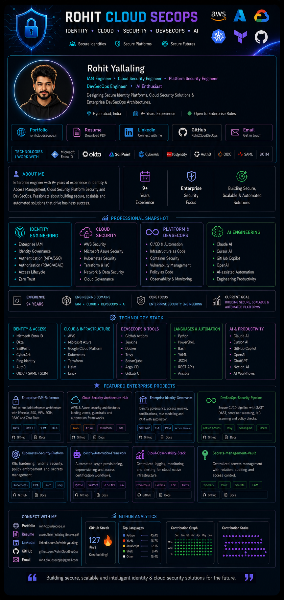

<!-- ════════════════════════════════════════════════════════════════
     ROHIT YALLALING · RohitCloudSecOps
     Enterprise Identity & Cloud Security Engineering Profile
════════════════════════════════════════════════════════════════ -->

<!-- ─────────────  FULL DESIGNED PROFILE  ───────────── -->

  

 

<!-- ─────────────  CLICKABLE ACTION BAR  ───────────── -->

&nbsp;

&nbsp;

&nbsp;

&nbsp;

 

---

<!-- ─────────────  LIVE GITHUB ANALYTICS  ───────────── -->

&nbsp;

  

  

  

<!-- Contribution Snake · generated by snake.yml workflow -->
<picture>
  <source media="(prefers-color-scheme: dark)" srcset="https://raw.githubusercontent.com/RohitCloudSecOps/RohitCloudSecOps/output/github-contribution-grid-snake-dark.svg" />
  <source media="(prefers-color-scheme: light)" srcset="https://raw.githubusercontent.com/RohitCloudSecOps/RohitCloudSecOps/output/github-contribution-grid-snake.svg" />
  
</picture>

  

&nbsp;

 

  <i>"Building secure, scalable and intelligent identity &amp; cloud security solutions for the future."</i>

