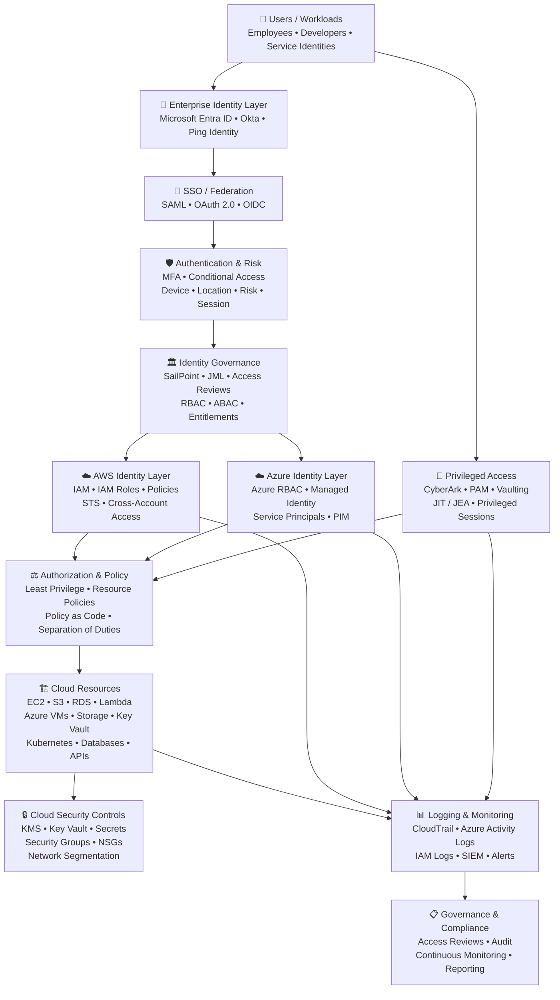

# 👋 Rohit Yallaling

### IAM Engineer | Cloud IAM | Identity Security | Cloud Security | DevSecOps

**Hyderabad, India**

Technology professional with **10+ years of experience** spanning application and security validation, software engineering, cloud platforms, **Enterprise IAM**, identity security, and **DevSecOps**. Focused on **Identity & Access Management, Identity Governance, PAM, Identity Lifecycle Management, Cloud IAM, SSO/Federation, cloud security, Infrastructure as Code, automation, and AI-assisted engineering**.

Building expertise across the intersection of **IAM → Identity Security → Cloud Security → DevSecOps → Automation**, with a security-first engineering approach centered on least privilege, governance, automation, and continuous security.

---

## 🧭 Career Journey

```text
Application & Security Validation Engineer
2015 – 2019
        │
        ▼
Software Engineer
2019 – 2020
        │
        ▼
IAM Engineer
2020 – Present
```

**Application & Security Validation → Security → Cloud / DevSecOps → IAM & Identity Security**

---

# 🔐 Core IAM Expertise

### Identity & Access Management

`Microsoft Entra ID` `AWS IAM` `SailPoint` `Okta` `Ping Identity` `CyberArk`

`IAM` `IGA` `PAM` `JML` `Identity Lifecycle Management`

`Access Governance` `RBAC` `ABAC` `Least Privilege` `Zero Trust`

### Authentication & Federation

`SSO` `MFA` `SAML 2.0` `OAuth 2.0` `OIDC`

`SCIM` `Federation` `Authentication` `Authorization`

### ☁️ Cloud Security

`AWS` `Azure` `Cloud IAM`

`AWS IAM Roles & Policies` `STS` `Cross-Account Access`

`Azure RBAC` `KMS` `Secrets Management`

`Cloud Logging` `Security Groups` `NSGs` `Network Segmentation`

### ⚙️ DevSecOps & Infrastructure

`Terraform` `Ansible` `Git` `GitHub`

`GitHub Actions` `Jenkins` `CI/CD`

`Docker` `Kubernetes` `Helm`

`Infrastructure as Code` `Policy as Code`

### 🛡️ Security Engineering

`Checkov` `Trivy` `Snyk` `Semgrep`

`SonarQube` `OWASP ZAP` `Falco` `OPA`

`IaC Security` `Container Security` `Security Scanning`

### 🐍 Programming & Automation

`Python` `Bash` `PowerShell`

`REST APIs` `JSON` `YAML`

`Automation` `Scripting`

### 🤖 AI-Assisted Engineering

`Claude` `Cursor`

`AI-Assisted Automation`

`AI-Assisted Debugging`

`Log / Error Analysis`

---

# 🏗️ IAM & Identity Security Capabilities

### Identity Security

* Identity Lifecycle Management
* Joiner-Mover-Leaver (**JML**) workflows
* Identity Governance and Administration (**IGA**)
* Access Governance
* Role-Based Access Control (**RBAC**)
* Attribute-Based Access Control (**ABAC**)
* Least Privilege
* Zero Trust
* SSO / MFA
* Identity Federation
* Application Onboarding
* Privileged Access Management (**PAM**)

### Cloud IAM Security

* AWS IAM
* Azure RBAC
* Cloud IAM
* Cross-Account Access
* IAM Policies
* Trust Relationships
* AWS STS
* KMS
* Cloud Logging
* Network Segmentation
* Security Groups / NSGs
* Identity-centric cloud security

### DevSecOps

* Terraform
* Infrastructure as Code
* CI/CD Security
* Policy as Code
* IaC Security
* Container Security
* Security Scanning
* GitHub Actions
* Kubernetes Security
* Continuous Security Automation

---

# 🏛️ Architecture Knowledge

### IAM Architecture


                         ┌───────────────────────────────┐
                         │        ENTERPRISE USERS       │
                         │ Employees • Contractors       │
                         │ Partners • Service Identities │
                         └───────────────┬───────────────┘
                                         │
                                         ▼
              ┌──────────────────────────────────────────────┐
              │              IDENTITY SOURCES                │
              │ HR System • Active Directory • Directories  │
              └─────────────────────┬────────────────────────┘
                                    │
                           JML / Identity Lifecycle
                                    │
                                    ▼
              ┌──────────────────────────────────────────────┐
              │          IDENTITY GOVERNANCE / IGA           │
              │                                              │
              │              SAILPOINT                       │
              │                                              │
              │ • Joiner-Mover-Leaver                        │
              │ • Access Requests                            │
              │ • Access Certifications                      │
              │ • RBAC / Entitlements                        │
              │ • SoD / Governance                           │
              │ • Provisioning / Deprovisioning              │
              └─────────────────────┬────────────────────────┘
                                    │
                         Provisioning / SCIM / API
                                    │
                    ┌───────────────┴────────────────┐
                    │                                │
                    ▼                                ▼
       ┌───────────────────────┐        ┌───────────────────────┐
       │   IDENTITY PROVIDER   │        │   PRIVILEGED ACCESS   │
       │                       │        │                       │
       │ Microsoft Entra ID    │        │       CyberArk        │
       │ Okta                  │        │                       │
       │ Ping Identity         │        │ • PAM                 │
       │                       │        │ • Vaulting             │
       │ Authentication        │        │ • JIT Privilege        │
       │ SSO / Federation      │        │ • Privileged Sessions  │
       │ MFA                   │        │ • Credential Security  │
       └───────────┬───────────┘        └───────────┬───────────┘
                   │                                │
                   │                                │
                   ▼                                ▼
       ┌─────────────────────────────────────────────────────┐
       │                 ZERO TRUST LAYER                    │
       │                                                     │
       │  Verify Explicitly • Least Privilege • Assume       │
       │  Breach • Device • User • Location • Risk •        │
       │  Application • Session Context                      │
       └────────────────────────┬────────────────────────────┘
                                │
                                ▼
       ┌─────────────────────────────────────────────────────┐
       │              AUTHENTICATION LAYER                   │
       │                                                     │
       │  SSO • MFA • Conditional Access • Federation        │
       │                                                     │
       │  SAML 2.0 • OAuth 2.0 • OIDC • SCIM                │
       └────────────────────────┬────────────────────────────┘
                                │
                                ▼
       ┌─────────────────────────────────────────────────────┐
       │             AUTHORIZATION / ACCESS                  │
       │                                                     │
       │  RBAC • ABAC • Policies • Entitlements              │
       │  Least Privilege • Privileged Access                │
       └────────────────────────┬────────────────────────────┘
                                │
                 ┌──────────────┼──────────────┐
                 │              │              │
                 ▼              ▼              ▼
        ┌──────────────┐ ┌──────────────┐ ┌──────────────┐
        │ Enterprise   │ │ Cloud        │ │ Privileged   │
        │ Applications │ │ Platforms    │ │ Resources    │
        │              │ │              │ │              │
        │ SaaS / Apps  │ │ AWS         │ │ Servers      │
        │ APIs         │ │ Azure       │ │ Databases    │
        │ Internal Apps│ │ Kubernetes  │ │ Network      │
        └──────┬───────┘ └──────┬───────┘ └──────┬───────┘
               │                │                │
               └────────────────┼────────────────┘
                                │
                                ▼
       ┌─────────────────────────────────────────────────────┐
       │             SECURITY / MONITORING                   │
       │                                                     │
       │ Audit Logs • Identity Logs • Access Logs            │
       │ SIEM • Threat Detection • Alerts • Reporting        │
       │ Compliance • Access Reviews • Forensics             │
       └─────────────────────────────────────────────────────┘


### Cloud IAM Security Architecture



----------------------------------------------------------------------

# ⚙️ Engineering Approach

| Principle                      | Focus                                                                        |
| ------------------------------ | ---------------------------------------------------------------------------- |
| 🔐 **Least Privilege**         | Minimize unnecessary access and permissions                                  |
| 🛡️ **Zero Trust**             | Verify identity, context, and authorization continuously                     |
| 🔒 **Security by Design**      | Integrate security into architecture and engineering workflows               |
| 🔄 **Identity Lifecycle**      | Govern identity access from Joiner to Mover to Leaver                        |
| 🏗️ **Infrastructure as Code** | Manage infrastructure consistently through code                              |
| 📜 **Policy as Code**          | Automate security and compliance controls                                    |
| 🤖 **Automation**              | Reduce manual identity and security operations                               |
| 🔁 **Continuous Security**     | Integrate security throughout CI/CD and cloud operations                     |
| 🔎 **Root Cause Analysis**     | Investigate failures through logs, evidence, and systematic analysis         |
| 🧠 **AI-Assisted Engineering** | Apply AI tools to automation, debugging, analysis, and engineering workflows |

------------------------------------------------------
              ZERO TRUST
     ┌─────────────────────────────┐
     │ Verify Explicitly            │
     │ Least Privilege              │
     │ Assume Breach                │
     │ Continuous Verification      │
     │ Risk-Based Access            │
     └──────────────┬──────────────┘
                    │
        ┌───────────┴───────────┐
        ↓                       ↓
     AWS IAM                Azure RBAC
        ↓                       ↓
        Cloud Resources        Cloud Resources
--------------------------------------------------------
____
# 💼 Professional Experience Summary

### 🔐 IAM Engineering

Experience across **Enterprise IAM, Identity & Access Management, Cloud IAM, Identity Governance, and Identity Security**, including:

* Microsoft Entra ID
* AWS IAM
* SailPoint
* Okta
* Ping Identity
* CyberArk
* JML and Identity Lifecycle Management
* RBAC / ABAC
* SSO / MFA
* SAML / OAuth 2.0 / OIDC / SCIM
* Access Governance
* Least Privilege
* Cloud IAM and authorization

### ☁️ Software Engineering / DevSecOps

Technical exposure across:

* AWS / Azure
* Terraform
* Ansible
* Git / GitHub
* Jenkins
* GitHub Actions
* CI/CD
* Docker
* Kubernetes
* Security Scanning
* Infrastructure as Code Security
* Policy as Code

### 🧪 Application & Security Validation

Background spanning:

* Functional Validation
* Integration Testing
* Regression Testing
* Security Validation
* Troubleshooting
* Log Analysis
* Root Cause Analysis
* Defect Analysis
* Release Qualification

---

# 🧰 Technology Stack

### 🔐 IAM


**Microsoft Entra ID · AWS IAM · SailPoint · Okta · Ping Identity · CyberArk · IAM · IGA · PAM**

### 🪪 Identity

`RBAC` `ABAC` `JML` `IGA` `PAM` `SSO` `MFA`

`SAML 2.0` `OAuth 2.0` `OIDC` `SCIM` `Federation`

`Identity Lifecycle Management` `Access Governance` `Least Privilege`

### ☁️ Cloud


`AWS` `Azure` `Cloud IAM` `KMS` `STS`

`IAM Roles & Policies` `Azure RBAC` `Cross-Account Access`

### ⚙️ DevSecOps


`Terraform` `Ansible` `Git` `GitHub` `GitHub Actions` `Jenkins`

`CI/CD` `Docker` `Kubernetes` `Helm`

`Infrastructure as Code` `Policy as Code`

### 🛡️ Security

`Checkov` `Trivy` `Snyk` `Semgrep`

`SonarQube` `OWASP ZAP` `Falco` `OPA`

`IaC Security` `Container Security` `Security Scanning`

### 🐍 Programming & Automation


`Python` `Bash` `PowerShell` `REST APIs` `JSON` `YAML`

`Automation` `Scripting`

### 🤖 AI-Assisted Engineering

`Claude` `Cursor`

`AI-Assisted Automation` · `AI-Assisted Debugging` · `Log / Error Analysis`

---

---

# 🔗 Connect With Me

**GitHub:** [RohitCloudSecOps](https://github.com/RohitCloudSecOps)

**Portfolio:** [rohitcloudsecops.in](https://rohitcloudsecops.in)

---

<p align="center">

**IAM • Identity Security • Cloud IAM • Cloud Security • DevSecOps • Automation**

</p>


<br/>

<!-- ─────────────  CLICKABLE ACTION BAR  ───────────── -->
<div align="center">

<a href="https://rohitcloudsecops.in"></a>
&nbsp;
<a href="assets/Rohit_Yallaling_Resume.pdf"></a>
&nbsp;
<a href="#"></a>
&nbsp;
<a href="https://github.com/RohitCloudSecOps"></a>
&nbsp;
<a href="mailto:rohit.cloudsecops@gmail.com"></a>

</div>

<br/>

---

<!-- ─────────────  LIVE GITHUB ANALYTICS  ───────────── -->
<div align="center">


&nbsp;


<br/><br/>


<br/><br/>


<br/><br/>

<!-- Contribution Snake · generated by snake.yml workflow -->
<picture>
  <source media="(prefers-color-scheme: dark)" srcset="https://raw.githubusercontent.com/RohitCloudSecOps/RohitCloudSecOps/output/github-contribution-grid-snake-dark.svg" />
  <source media="(prefers-color-scheme: light)" srcset="https://raw.githubusercontent.com/RohitCloudSecOps/RohitCloudSecOps/output/github-contribution-grid-snake.svg" />
  
</picture>

<br/><br/>


&nbsp;
<a href="https://github.com/RohitCloudSecOps?tab=followers"></a>

</div>

<br/>

<div align="center">
  <i>"Building secure, scalable and intelligent identity &amp; cloud security solutions for the future."</i>
</div>
