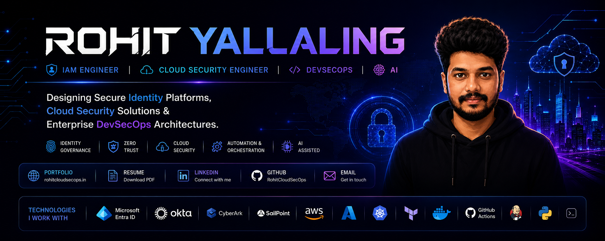
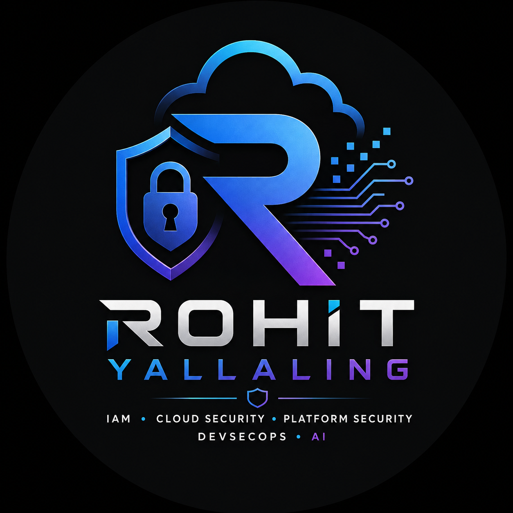

<!-- ════════════════════════════════════════════════════════════════
     ROHIT YALLALING · RohitCloudSecOps
     Enterprise Identity & Cloud Security Engineering Profile
════════════════════════════════════════════════════════════════ -->

<!-- ════════════════════════════════════════════════════════════════
     PART 1 · HERO SECTION
════════════════════════════════════════════════════════════════ -->

<!-- Enterprise Banner -->

  

 

<!-- Hero Card: Profile (left) · Identity (right) -->
<table width="100%" border="0" cellspacing="0" cellpadding="0">
<tr>

<!-- Profile Image -->
<td width="30%" align="center" valign="middle">
  
</td>

<!-- Identity Block -->
<td width="70%" valign="middle">

<h1>Rohit&nbsp;Yallaling</h1>

<b>IAM Engineer</b> &nbsp;·&nbsp; <b>Cloud Security Engineer</b> &nbsp;·&nbsp; <b>Platform Security Engineer</b> &nbsp;·&nbsp; <b>DevSecOps Engineer</b>

  

&nbsp;

&nbsp;

  

Enterprise engineer specializing in <b>Identity &amp; Access Management</b>, <b>Cloud Security</b>, and <b>DevSecOps</b>. I design secure identity platforms, Zero Trust architectures, and cloud-native security solutions — engineered for scale, governance, and enterprise compliance.

</td>
</tr>
</table>

 

<!-- Executive Action Bar -->

&nbsp;

&nbsp;

&nbsp;

&nbsp;

 

---

<!-- ════════════════════════════════════════════════════════════════
     PART 2 · PROFESSIONAL SNAPSHOT
════════════════════════════════════════════════════════════════ -->

  

 

<table width="100%" border="0" cellspacing="0" cellpadding="10">
<tr>
<td width="50%" valign="top">

<b>Experience</b>
 
9+ years of enterprise engineering across identity platforms, cloud security, and secure delivery pipelines.

</td>
<td width="50%" valign="top">

<b>Industry</b>
 
Enterprise Security · Identity Platforms · Cloud Infrastructure · Regulated & Compliance-driven environments.

</td>
</tr>

<tr>
<td width="50%" valign="top">

<b>Specializations</b>
 
Identity &amp; Access Management · Cloud Security · Platform Security · DevSecOps · Enterprise Architecture.

</td>
<td width="50%" valign="top">

<b>Engineering Focus</b>
 
Zero Trust design · Identity governance · Secure automation · AI-assisted engineering.

</td>
</tr>
</table>

 

<table border="0" cellspacing="0" cellpadding="8">
<tr>
<td align="center"></td>
<td align="center"></td>
<td align="center"></td>
</tr>
<tr>
<td align="center"></td>
<td align="center"></td>
<td align="center"></td>
</tr>
</table>

 

---

<!-- ════════════════════════════════════════════════════════════════
     PART 3 · TECHNOLOGY STACK
════════════════════════════════════════════════════════════════ -->

  

 

<table width="100%" border="0" cellspacing="0" cellpadding="12">

<!-- Identity -->
<tr>
<td width="18%" valign="middle"><b>Identity</b></td>
<td width="82%" valign="middle">

</td>
</tr>

<!-- Cloud -->
<tr>
<td valign="middle"><b>Cloud</b></td>
<td valign="middle">

&nbsp;

</td>
</tr>

<!-- DevSecOps -->
<tr>
<td valign="middle"><b>DevSecOps</b></td>
<td valign="middle">

&nbsp;

</td>
</tr>

<!-- Automation -->
<tr>
<td valign="middle"><b>Automation</b></td>
<td valign="middle">

</td>
</tr>

<!-- Programming -->
<tr>
<td valign="middle"><b>Programming</b></td>
<td valign="middle">

&nbsp;

</td>
</tr>

<!-- AI -->
<tr>
<td valign="middle"><b>AI</b></td>
<td valign="middle">

</td>
</tr>

</table>

 

---

<!-- ════════════════════════════════════════════════════════════════
     PART 4 · FEATURED PROJECTS
════════════════════════════════════════════════════════════════ -->

  

 

<table width="100%" border="0" cellspacing="0" cellpadding="16">

<!-- Row 1 -->
<tr>
<td width="50%" valign="top">

### Enterprise IAM Reference

Reference architecture for enterprise Identity &amp; Access Management — identity lifecycle, authentication flows, provisioning, and Zero Trust patterns.

  

</td>
<td width="50%" valign="top">

### Cloud Security Architecture Hub

Enterprise cloud security reference across AWS and Azure — secure architecture, encryption, network security, and governance patterns.

  

</td>
</tr>

<!-- Row 2 -->
<tr>
<td width="50%" valign="top">

### Enterprise Identity Governance Reference

Identity governance reference — access lifecycle, certification, role management, provisioning models, and governance workflows.

  

</td>
<td width="50%" valign="top">

### DevSecOps Security Pipeline

Enterprise DevSecOps reference — secure CI/CD, automated security scanning, container security, and infrastructure validation.

  

</td>
</tr>

</table>

 

---

<!-- ════════════════════════════════════════════════════════════════
     PART 5 · GITHUB ANALYTICS
════════════════════════════════════════════════════════════════ -->

  

 

&nbsp;

  

  

  

<!-- Contribution Snake · generated by snake.yml workflow -->
<picture>
  <source media="(prefers-color-scheme: dark)" srcset="https://raw.githubusercontent.com/RohitCloudSecOps/RohitCloudSecOps/output/github-contribution-grid-snake-dark.svg" />
  <source media="(prefers-color-scheme: light)" srcset="https://raw.githubusercontent.com/RohitCloudSecOps/RohitCloudSecOps/output/github-contribution-grid-snake.svg" />
  
</picture>

  

&nbsp;

 

---

<!-- ════════════════════════════════════════════════════════════════
     PART 6 · REPOSITORY CATALOG
════════════════════════════════════════════════════════════════ -->

  

 

<table width="100%" border="0" cellspacing="0" cellpadding="10">
<tr align="left">
<th>Repository</th>
<th>Category</th>
<th>Status</th>
<th>Description</th>
<th>Links</th>
</tr>

<tr>
<td><b>Enterprise IAM Reference</b></td>
<td></td>
<td></td>
<td>Enterprise IAM architecture, lifecycle, and Zero Trust patterns.</td>
<td>

</td>
</tr>

<tr>
<td><b>Cloud Security Architecture Hub</b></td>
<td></td>
<td></td>
<td>Secure AWS &amp; Azure architecture, encryption, and governance.</td>
<td>

</td>
</tr>

<tr>
<td><b>Enterprise Identity Governance Reference</b></td>
<td></td>
<td></td>
<td>Access lifecycle, certification, role and provisioning models.</td>
<td>

</td>
</tr>

<tr>
<td><b>DevSecOps Security Pipeline</b></td>
<td></td>
<td></td>
<td>Secure CI/CD, security scanning, and container security.</td>
<td>

</td>
</tr>

</table>

 

---

<!-- ════════════════════════════════════════════════════════════════
     PART 7 · CONTACT & FOOTER
════════════════════════════════════════════════════════════════ -->

  

 

&nbsp;

&nbsp;

&nbsp;

 

  <b>Engineering secure identity platforms and cloud security solutions for the enterprise.</b>
    
  Identity &nbsp;·&nbsp; Cloud Security &nbsp;·&nbsp; Platform Security &nbsp;·&nbsp; DevSecOps &nbsp;·&nbsp; Enterprise Architecture
    
  

